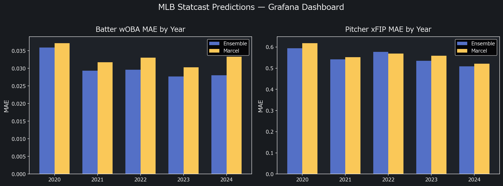

# baseball-mlops

**MLB Statcast × GCP × MLOps — Player performance prediction pipeline**

> **v11 開発中 (2026-03-24):** BigQuery pitch-level Statcast データ（6.8M 行 × 122 列）を選手×シーズンに集計し、打者 8 / 投手 9 スキルグループの階層 Bayes モデルに統合。Weekly auto-retrain は計算環境の見直し後に再開予定。ダッシュボード・API は稼働中です。

MLB Statcast のトラッキングデータ（打球速度・バレル率・xwOBA 等）を使い、
Marcel 法を上回る選手成績予測モデルを **GCP 分析基盤 (BigQuery + BigQuery ML + Cloud Run)** 上で MLOps パイプラインとして継続運用する。

| 環境 | URL | 説明 |
|---|---|---|
| 本番 API | Cloud Run (`baseball-mlops-api`) | FastAPI サーバーレス推論 |
| 本番 Dashboard | https://baseball-mlops.streamlit.app/ | Streamlit Cloud |
| 開発 Dashboard | https://baseball-mlops-dev.streamlit.app/ | Spring Training 検証 |
| データ基盤 | BigQuery `data-platform-490901.mlb_statcast` | 生データ + BQML モデル |
| 共有データ基盤 | [mlb-data-pipeline](https://github.com/yasumorishima/mlb-data-pipeline) | FanGraphs / Savant / Statcast 共有 BQ テーブル |
| Grafana | [MLB Statcast Predictions](https://yasumorishima.grafana.net/public-dashboards/4089c1bbd6834f2082921329219b5b44) | 予測分布・バックテスト・モデル比較 |



## 解説記事

- [Statcastデータで選手成績予測の精度は上がるか — Marcel法との比較](https://zenn.dev/shogaku/articles/baseball-mlops-statcast-vs-marcel)（Zenn）
- [Can Statcast Data Improve MLB Player Performance Predictions?](https://dev.to/yasumorishima/can-statcast-data-improve-mlb-player-performance-predictions-beating-marcel-with-lightgbm-1lb5)（DEV.to）

---

## 精度（時系列 CV バックテスト）

| | Marcel 法 | LightGBM | CatBoost | Bayes (v9 ElasticNet) | Component (PECOTA) | Ensemble |
|---|---|---|---|---|---|---|
| 打者 wOBA MAE | 0.0326 | 0.0295 | 0.0295 | **0.0287** | 0.0445 | 逆MAE重み付き |
| 投手 xFIP MAE | 0.5576 | 0.5326 | 0.5309 | **0.4825** | 0.5475 | 逆MAE重み付き |

※ 未来リークなしの時系列 expanding-window CV による正直な値
※ LightGBM / CatBoost は Optuna 最適化済み（LGB 1000 trials / CatBoost 60 trials + MedianPruner）
※ Ensemble = 最大5モデルの逆MAE重み付き平均（利用可能なモデルで動的に構築）
※ **v10 で Bayes を Stan 階層モデルに置き換え済み → v11 で BQ pitch-level 特徴量を全面統合**

NPB では Statcast 相当の特徴量が揃わず Marcel 法に届かなかったが、
MLB Statcast の豊富なトラッキング特徴量（EV / Barrel% / Whiff% 等）を使うことで ML が上回った。

### Year-by-Year Backtest (ML vs Marcel)

| Year | Batter wOBA | | Pitcher xFIP | |
|------|-------------|---|-------------|---|
| | ML MAE | Marcel MAE | ML MAE | Marcel MAE |
| 2020 | 0.0359 | 0.0371 (+3.2%) | 0.595 | 0.618 (+3.7%) |
| 2021 | 0.0293 | 0.0317 (+7.6%) | 0.542 | 0.553 (+1.9%) |
| 2022 | 0.0296 | 0.0330 (+10.3%) | 0.578 | 0.569 (-1.5%) |
| 2023 | 0.0277 | 0.0303 (+8.7%) | 0.535 | 0.559 (+4.3%) |
| 2024 | 0.0280 | 0.0333 (+16.0%) | 0.509 | 0.522 (+2.5%) |
| **2025** | **0.0291** | **0.0331 (+12.1%)** | **0.484** | **0.504 (+4.0%)** |

**Batter**: ML wins all 5 CV years + 2025 holdout. Post-2023 improvement accelerating.
**Pitcher**: ML wins 4/5 CV years + 2025 holdout. 2022 loss likely due to limited training data (COVID 2020-2021 only).
**2025 holdout**: True holdout (never seen by Optuna/CV). Both batter and pitcher ML wins — no overfitting.

### 2025 Strict Holdout

2025 is evaluated as a **true holdout** — never seen during Optuna hyperparameter tuning or CV.
Optuna 1000 trials are tuned exclusively on 2020-2024 data, then the final model is trained on
all pre-2025 data and evaluated once on 2025. This eliminates any indirect data leakage concern.

| | ML MAE | Marcel MAE | ML wins | Improvement |
|---|---|---|---|---|
| Batter wOBA | **0.0291** | 0.0331 | Yes | +12.1% |
| Pitcher xFIP | **0.4837** | 0.5038 | Yes | +4.0% |

CV results (0.0281 / 0.521) and holdout results (0.0291 / 0.484) are consistent — no overfitting detected.

---

## 特徴

| 項目 | 内容 |
|---|---|
| 予測ターゲット | 打者: 翌年 wOBA / 投手: 翌年 xFIP |
| モデル (Python) | LightGBM + CatBoost + **Stan 階層 Bayes** + Component (PECOTA方式) |
| モデル (BQML) | Boosted Tree Regressor + 線形回帰（SQL だけで ML） |
| 最適化 | Optuna（LGB 1000 / CatBoost 60 + MedianPruner / Component 各40 trials） |
| ベースライン | Marcel 法（Tom Tango考案、加重平均 + 平均回帰 + 年齢調整） |
| アンサンブル | 最大5モデルの逆MAE重み付き平均（動的構築） |
| データ | MLB Statcast + Bat Tracking + Arsenal via pybaseball / savant-extras |
| データ基盤 | BigQuery — 生データ13テーブル + 予測結果 + メトリクス履歴 |
| 球場補正 | savant-extras で FanGraphs から動的取得（pf_5yr） |
| 自動再学習 | GitHub Actions cron（毎週月曜 JST 11:00）— **一時停止中** |
| モデル管理 | W&B Model Registry（production タグ自動昇格） |
| API (本番) | Cloud Run — FastAPI サーバーレスコンテナ（Artifact Registry 経由） |
| API (開発) | RPi5 Docker（port 8002）— W&B から 6 時間ごとに最新モデルを自動ロード |
| ダッシュボード | Streamlit — Marcel / ML / Bayes 3列比較・Spring Training 検証 |
| 通知 | Discord Webhook（Python + BQML 全モデルMAE詳細を自動通知） |

---

## アーキテクチャ

### GCP 分析基盤（v11）

> **開発経緯の注記**: 通常の実務フローでは BQML（SQL）でプロトタイプ → Python で本番化という順序ですが、本プロジェクトは GCP 未使用の状態で開発を始めたため Python 本番モデル（LightGBM/CatBoost 等 5モデルアンサンブル）が先に充実しました。現在は逆方向に、BQML の精度を Python 版に揃えていく段階です。

```
[GitHub Actions — 毎週月曜 JST 11:00]
  ↓ fetch_statcast.py      pybaseball / savant-extras →
                           FanGraphs + Statcast + Bat Tracking + Arsenal + park_factors
  ↓ fetch_bq_features.py   BigQuery mlb_wp.statcast_pitches (6.8M rows) →
                           選手×シーズン集計 (打者40+/投手50+特徴量)
  ↓ train.py               LightGBM — Optuna 1000 trials + Recency Decay 0.85/年
  ↓ train_catboost.py      CatBoost — Optuna 60 trials + MedianPruner + 異なる分割戦略
  ↓ train_components.py    PECOTA方式 — K%/BB%/BABIP/ISO(HR/9) 個別予測 → Ridge再構成
  ↓ train_bayes.py         Stan 階層 Bayes — 選手ランダム効果 + スキル群別正則化 + MCMC
  ↓ ensemble.py            5モデル逆MAE重み付き平均（利用可能モデルで動的構築）
  ↓ W&B Artifact 保存      MAE / 特徴量重要度 / Optuna best_params / モデルファイル
  ↓ load_to_bq.py          BigQuery に生データ13テーブル + 予測結果をロード
  ↓ bqml_train.py          BigQuery ML — Boosted Tree + 線形回帰（SQLだけでML）
  ↓ predictions/ コミット   Streamlit Cloud が直接読み込む
  ↓ Discord 通知           Python + BQML 全モデルMAE詳細つき通知

[Cloud Run — baseball-mlops-api（本番 API）]
  FastAPI コンテナをサーバーレスデプロイ
  Artifact Registry 経由で Docker イメージを管理
  retrain 完了後に自動デプロイ (master のみ)

[RPi5 — FastAPI / Docker port 8002（開発 API）]
  起動時 + 6 時間ごとに W&B production モデルを自動ロード
  POST /model/reload で即時反映も可能

[BigQuery — data-platform-490901.mlb_statcast]
  生 Statcast データ 13テーブル + 予測結果 + BQML モデル + メトリクス履歴
  ※ FanGraphs / Savant 生データは mlb-data-pipeline (mlb_shared) から取得
  分析用ビュー 7本（打球品質リーダーボード、投手球種戦略分析 等）

[Streamlit — 本番 / 開発 2 環境]
  本番 (master)  打者 wOBA / 投手 xFIP 予測ランキング + Marcel vs ML 散布図
  開発 (develop) 上記 + Spring Training 2026 実績 vs 予測 リアルタイム検証
```

### AWS/GCP 対応表

本プロジェクトは、プロ野球球団が運用する AWS SageMaker + Airflow パイプラインと同等のアーキテクチャを GCP 上に構築している。

| 球団 AWS 基盤 | 本プロジェクト GCP 基盤 | 対応関係 |
|---|---|---|
| TrackMan / Hawk-Eye | pybaseball Statcast（同一トラッキングデータ） | データソース |
| S3 (raw data lake) | BigQuery `mlb_statcast` 生データ 13 テーブル | データレイク |
| Airflow DAG | GitHub Actions `weekly_retrain.yml` | オーケストレーション |
| SageMaker Processing Job | RPi5 self-hosted runner（Python 学習） | バッチ学習 |
| SageMaker Batch Transform | BigQuery ML `CREATE MODEL`（SQL ML） | SQL モデル学習 |
| SageMaker Endpoint | Cloud Run FastAPI コンテナ | 推論 API |
| ダッシュボード | Streamlit Cloud + BigQuery Studio | 可視化 |

---

## モデル詳細

### LightGBM（train.py）
- **CV**: 時系列 expanding-window splits（先頭2年 training only、3年目以降を val）
- **最適化**: Optuna 1000トライアル（TPESampler + MedianPruner）
  - 探索パラメータ: `learning_rate` / `num_leaves` / `min_child_samples` / `feature_fraction` / `bagging_fraction` / `reg_alpha` / `reg_lambda`
  - `n_estimators` 上限 1000 + early_stopping=50 で自動打ち切り

### CatBoost（train_catboost.py）
- **CV**: LightGBM とは異なる分割戦略でアンサンブル多様性を確保
- **最適化**: Optuna 60 トライアル + MedianPruner（ARM64 RPi5 向けに最適化）
- **Recency Decay**: 0.85/年で近年サンプルを重み付け
- **OOF**: `cat_oof_batter/pitcher.csv` → Bayes スタッキングに利用

### Component Prediction — PECOTA 方式（train_components.py）
- **打者**: K% / BB% / BABIP / ISO を個別に LightGBM で予測 → Ridge で wOBA を再構成
- **投手**: K% / BB% / HR/9 を個別に LightGBM で予測 → Ridge で xFIP を再構成
- **最適化**: 各コンポーネント Optuna 40 トライアル（ARM64 最適化）
- 個別指標の予測を合成するため、モデルの解釈性が高い

### Stan Hierarchical Bayes（train_bayes.py, v11）
- **フレームワーク**: Stan (cmdstanpy) — NUTS MCMC 4 chains × 500 warmup + 1000 samples
- **選手ランダム効果**: 部分プーリング（non-centered parameterization）— 低PA選手をリーグ平均に引き寄せ
- **スキル群別階層正則化**: 特徴量をドメイン知識で **10群（打者）/ 12群（投手）** に分類し、群ごとに正則化スケール τ を推定
  - 打者 (10群): Contact / Discipline / Expected / Context / **Offense** (wRC+/WAR/Off/OPS/wRAA/HR/FB) / **Batted Ball FG** (GB%/FB%/LD%/IFFB%/Pull%/Cent%/Oppo%/Soft%/Med%/Hard%) / **Approach BQ** (whiff/chase/zone contact/zone swing/called strike/first pitch swing) / **Batted Ball BQ** (GB/FB/LD/popup/sweet spot/距離) / **Power BQ** (EV avg/max/p90/hard hit/barrel) / **Run Value BQ** (run value/xwOBA/xBA/count leverage)
  - 投手 (12群): Stuff (K%/Stuff+/Pitching+/SwStr%) / Command (BB%/Location+/CSW%/O-Swing%/Z-Contact%/Zone%) / Contact Mgmt / Arsenal / Context / **ERA Models** (SIERA/ERA-/FIP-/xFIP-/WAR) / **Batted Ball FG** (GB%/FB%/LD%/HR/FB/Pull%/Cent%/Oppo%/Soft%/Med%/Hard%) / **Role** (GS/Start-IP/Relief-IP) / **Velo BQ** / **Command BQ** / **Contact BQ** / **Fatigue BQ**
- **BQ データソース**: `mlb_wp.statcast_pitches`（6.8M 行 × 122 列、2015-2024）→ SQL で選手×シーズン集計
- **スタッキング**: LGB/CatBoost OOF delta を Bayes 事前分布 N(0.3, 0.2) / N(0.2, 0.2) でメタ学習
- **異分散ノイズ**: σ(PA) = σ_base × exp(γ × z_log_pa) — 低PAで広い信用区間
- **加齢曲線**: 二次（β_age + β_age2 × age²）— ピーク27歳、30歳以降加速的衰退
- **CI**: MCMC 事後予測分布の 10th/90th パーセンタイル = 真の 80% 信用区間
- **フォールバック**: cmdstanpy 不在時は ElasticNet に自動退避

### 特徴量（打者: 100+個 / 投手: 110+個）
| カテゴリ | 打者 | 投手 |
|---|---|---|
| Statcast (API) | K%/BB%/BABIP/brl_percent/avg_hit_speed/xwOBA/sprint_speed/ev95percent | K%/BB%/BABIP/brl_percent/avg_hit_speed/est_woba/ev95percent |
| FanGraphs 基本 | HardHit%/Contact%/O-Swing%/SwStr%/G | K-BB%/CSW%/SwStr%/G/IP/Stuff+/Location+/Pitching+ |
| **FG 攻撃/防御 (v11)** | **wRC+/WAR/Off/Def/BsR/Spd/AVG/OPS/wRAA/HR/FB** | **WAR/SIERA/ERA-/FIP-/xFIP-/K/9/BB/9/K/BB/HR/FB** |
| **FG 打球タイプ (v11)** | **GB%/FB%/LD%/IFFB%/Pull%/Cent%/Oppo%/Soft%/Med%/Hard%** | **GB%/FB%/LD%/IFFB%/Pull%/Cent%/Oppo%/Soft%/Med%/Hard%** |
| **FG ゾーン (v11)** | **O-Contact%/Z-Contact%/Z-Swing%** | **O-Swing%/Z-Swing%/O-Contact%/Z-Contact%/Zone%** |
| **FG 球種価値 (v11)** | **wFB/C/wSL/C/wCH/C** | **wFB/C/wSL/C/wCH/C** |
| **FG 役割 (v11)** | — | **GS/Start-IP/Relief-IP** |
| Bat Tracking (v8) | avg_bat_speed/swing_tilt/attack_angle/ideal_attack_angle_rate | — |
| Batted Ball (v8) | pull_rate/oppo_rate | — |
| Arsenal (v8) | — | n_pitch_types/primary_usage/best_whiff/avg_whiff_weighted/best_rv100/usage_entropy |
| **BQ Plate Discipline (v11)** | **whiff/chase/zone_contact/zone_swing/called_strike/first_pitch_swing/two_strike_whiff** | **whiff/chase_induced/csw/zone_rate/edge_rate/first_pitch_strike** |
| **BQ Batted Ball (v11)** | **GB/FB/LD/popup rate/sweet_spot/avg_hit_distance** | **GB/FB induced/EV against/barrel against/hard_hit against/xwOBA against** |
| **BQ Power (v11)** | **avg/max/p90 EV/EV consistency/hard_hit/barrel rate** | — |
| **BQ Stuff (v11)** | — | **velo/spin/movement/extension/arm_angle/FB detail/BRK detail/CH detail/velo diff** |
| **BQ Fatigue (v11)** | — | **TTO別 run value (1st/2nd/3rd)/degradation** |
| **BQ Run Value (v11)** | **avg_run_value/xwOBA/xBA/count_leverage** | **pitcher_run_value/FB・BRK・CH別 run value** |
| **BQ Pitch Mix (v11)** | **velo_faced/fastball%/breaking%/offspeed% faced** | **fastball%/breaking%/offspeed% thrown** |
| **BQ Bat Tracking (v11)** | **bat_speed/swing_length/attack_angle/consistency/max** | — |
| **BQ Baserunning (v11)** | **SB success rate/SB attempt rate** | — |
| Lag delta | wOBA/xwOBA/K%/BB%/brl/bat_speed + **BQ whiff/chase/EV/barrel/LD delta** | xFIP/K%/BB%/K-BB%/whiff/entropy + **BQ velo/spin/whiff/zone/EV/GB delta** |
| Interaction | age_x_luck（Age × xwOBA-wOBA乖離） | age_x_kbb（Age × K-BB%） |
| Engineered | age_from_peak/age_sq/pa_rate/xwoba_luck/park_factor/team_changed | age_from_peak/age_sq/ip_rate/fip_era_gap/park_factor/team_changed |
| Stacking | lgb_delta / cat_delta | lgb_delta / cat_delta |

---

## ブランチ戦略

```
master  ─→  baseball-mlops.streamlit.app     （本番）
  ↑ PR merge
develop ─→  baseball-mlops-dev.streamlit.app  （開発・検証）
```

- `develop` で Spring Training 検証・UI 改善・モデル改善を試す
- 安定したら `master` に merge して本番反映
- Spring Training データの自動コミット — **一時停止中**

---

## GitHub Secrets

| Secret | 内容 |
|---|---|
| `WANDB_API_KEY` | W&B API キー |
| `WANDB_ENTITY` | W&B チーム名 |
| `API_RELOAD_URL` | FastAPI 公開 URL（RPi5、任意） |
| `GCP_SA_KEY` | GCP サービスアカウント JSON 鍵（BigQuery + Cloud Run） |
| `DISCORD_WEBHOOK_URL` | Discord 通知 Webhook URL |

---

## BigQuery Data Platform

All Statcast raw data, predictions, and BQML models are stored in BigQuery (free tier).

| Item | Value |
|---|---|
| Project | `data-platform-490901` |
| Dataset | `mlb_statcast` |

### Raw Data Tables (weekly auto-refresh)

| テーブル | ソース | 内容 |
|---|---|---|
| `raw_fg_batting` | FanGraphs | 打者成績 (wOBA/xwOBA/K%/BB% 等) |
| `raw_fg_pitching` | FanGraphs | 投手成績 (xFIP/FIP/ERA 等) |
| `raw_sc_batter_exitvelo` | Statcast | 打球速度・バレル率 |
| `raw_sc_batter_expected` | Statcast | 打者期待値 (xBA/xSLG/xwOBA) |
| `raw_sc_sprint_speed` | Statcast | スプリント速度 |
| `raw_sc_batted_ball` | Statcast | 打球方向 (pull/oppo rate) |
| `raw_sc_bat_tracking` | Hawk-Eye | バット追跡 (bat speed/swing tilt/attack angle 等) |
| `raw_sc_pitcher_exitvelo` | Statcast | 被打球速度 |
| `raw_sc_pitcher_expected` | Statcast | 投手期待値 |
| `raw_sc_pitcher_arsenal` | Statcast | 球種別統計 |
| `raw_park_factors` | FanGraphs | 球場補正係数 |
| `raw_batter_features` | 統合 | 打者全特徴量 (~95列) |
| `raw_pitcher_features` | 統合 | 投手全特徴量 (~105列) |

### Prediction & Model Tables

| テーブル | 内容 |
|---|---|
| `batter_predictions` / `pitcher_predictions` | Python 5-model ensemble 予測 |
| `bqml_predictions_batter` / `bqml_predictions_pitcher` | BQML Boosted Tree + 線形回帰 予測 |
| `model_metrics_history` | 全モデル MAE 時系列記録 |
| `backtest_outliers_*` / `backtest_yearly_mae_*` | バックテスト結果 |

### BQML Models

| モデル | タイプ | ターゲット |
|---|---|---|
| `bqml_batter_woba` | Boosted Tree Regressor | 翌年 wOBA |
| `bqml_pitcher_xfip` | Boosted Tree Regressor | 翌年 xFIP |
| `bqml_batter_woba_linear` | Linear Regression | 翌年 wOBA |
| `bqml_pitcher_xfip_linear` | Linear Regression | 翌年 xFIP |

### Analysis Views

`v_batter_trend` / `v_pitcher_trend` / `v_batted_ball_leaders` / `v_pitcher_arsenal` / `v_park_effects` / `v_model_comparison` / `v_data_coverage`

---

## API エンドポイント

| Endpoint | 説明 |
|---|---|
| `GET /predict/hitter/{name}` | 打者 翌年 wOBA（Marcel + ML + Bayes CI） |
| `GET /predict/pitcher/{name}` | 投手 翌年 xFIP（Marcel + ML + Bayes CI） |
| `GET /rankings/hitters` | wOBA 予測ランキング |
| `GET /rankings/pitchers` | xFIP 予測ランキング（低い順） |
| `GET /model/info` | 現在のモデルバージョン・更新日時・MAE |
| `POST /model/reload` | W&B から最新モデルを手動リロード |

---

## 今後の検討

### モデル改善
| 項目 | 概要 | 期待効果 |
|---|---|---|
| **Marcel 重みの MLB 最適化** | 現在 Tango 原典値（5/4/3、REG_PA=1200）を使用。NPB では最適化で MAE 1.4% 改善実績あり。MLB Statcast 期（2015〜）データでグリッドサーチ + ブートストラップ検定で再評価する | ベースライン精度向上 |
| **Neural Network（TabNet / FT-Transformer）** | テーブルデータ向け深層学習。LGB/Cat とは異なる非線形パターンを学習 | アンサンブル多様性向上 |
| **Similarity-Based Prediction** | 過去の類似選手キャリアパスから予測（PECOTA original approach） | 急激な衰退・ブレイクアウト検出 |
| ~~**Pitch-Level Features**~~ | ~~球種別 Stuff+ / Location+ をピッチレベルで集約~~ | **v11 で実装済み** — BQ pitch-level 集計 |
| **Platoon Splits** | 対左/対右の成績差を特徴量に追加 | プラトーン選手の精度向上 |
| **Injury / Workload Features** | IL 日数・前年投球数・WAR推移から故障リスクを加味 | 稼働率の予測 |
| **Bayesian Hyperparameter Transfer** | 前週の Optuna best_params を初期値に warm-start | 学習時間短縮 |
| **Stan 潜在スキル因子モデル** | Contact/Discipline/Speed を潜在変数として推定し、Statcast をその観測とみなす因子分析的拡張 | 欠損データ自然処理・解釈性向上 |
| **Stan AR(1) 状態空間** | 選手スキルの時系列進化を陽にモデリング（現在は静的ランダム効果） | キャリア軌道予測 |

### データ拡張
| 項目 | 概要 |
|---|---|
| **Minor League Statcast** | MiLB Hawk-Eye データ（取得可能になり次第） |
| ~~**Catcher Framing**~~ | ~~捕手フレーミング指標~~ → **mlb-data-pipeline 経由で取得済み（`mlb_shared.catcher`）** |
| ~~**Defensive Metrics**~~ | ~~OAA / DRS をポジション別に取得~~ → **mlb-data-pipeline 経由で取得済み（`mlb_shared.oaa`）** |

### インフラ・運用
| 項目 | 概要 |
|---|---|
| **BQML アンサンブル統合** | BQML Boosted Tree の精度が Python 版に迫れば、Cloud Run API で BQML 予測も返す |
| **BigQuery Scheduled Query** | BigQuery 上で定期分析クエリを自動実行し、ダッシュボードに反映 |
| **A/B テスト基盤** | 新モデルと production モデルを並行評価し自動昇格 |
| **Data Drift 検出** | 入力特徴量の分布変化を W&B で監視・アラート |
| **Streamlit 選手比較機能** | 2選手の予測・特徴量を横並び比較 |
| **API レスポンスキャッシュ** | Redis で予測結果をキャッシュし応答速度向上 |

### NPB Hawk-Eye への移植

Statcast = Hawk-Eye と同じトラッキングデータ形式。
NPB Hawk-Eye データ公開後、`fetch_statcast.py` のデータソースを差し替えるだけで移植可能な設計。

---

*Built with Claude Code / Stan + LightGBM + CatBoost + Optuna + W&B + BigQuery + BigQuery ML + Cloud Run + FastAPI + Streamlit + GitHub Actions*
